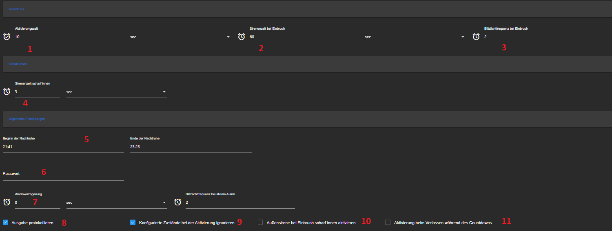
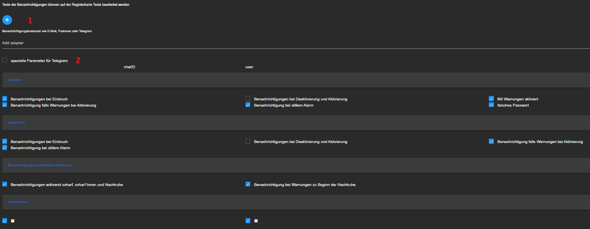
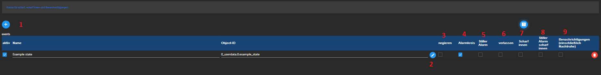
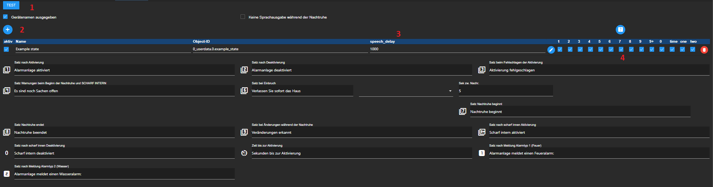
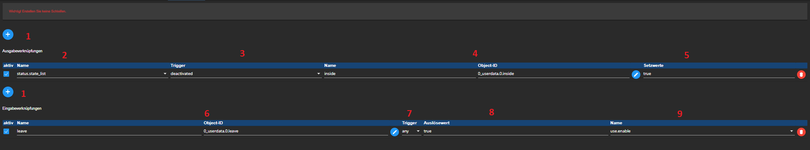
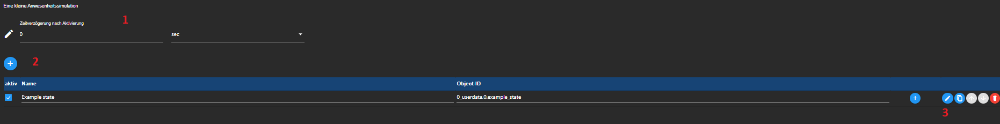
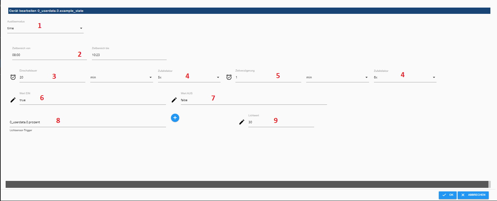

# ioBroker.alarm

 

**Github Actions**:

# Inhalt
* [Grundlegendes](#iobroker-alarm)
* [Haupteinstellungen](#tab-haupteinstellungen)
* [Benachrichtigungen](#tab-benachrichtigungen)
* [Überwachung](#tab-überwachung)
* [Sprachausgabe](#tab-sprachausgabe)
* [Verknüpfungen](#tab-verknüpfungen)
* [Andere Alarme](#tab-andere-alarme)
* [Zonen](#tab-zonen)
* [Anwesenheitssimulation](#tab-anwesenheit)
* [States](#states)

## ioBroker Alarm

Dies ist ein Adapter, mit dem sich eine Alarmanlage ohne große programmiertechnische Vorkenntnisse realisieren lässt.
Er bietet die Möglichkeit 3 Sicherheitskreise zu konfigurieren und diese z. B. bei Nachtruhe oder De- und Aktivierung zu überwachen. Des Weiteren ist
eine direkte Verknüpfung der jeweiligen Instanz "states", auf andere "states" möglich. Diese Verknüpfungen werden im Reiter Verknüpfungen angelegt. Eine einfache Anwesenheitssimulation lässt sich ohne Weiteres konfigurieren und erhöht somit den Schutz vor Einbrechern. Eine Benachrichtigung über diverse Ereignisse ist ebenso möglich und kann über diverse Kanäle wie z.B. Telegramm oder Email erfolgen. *(Vorrausgesetzt der entsprechende Adapter ist installiert!)*

**Alle states für die Überwachung und der Zonen müssen vom Typ "boolean" sein! *(true, false, 1, 0)***

----------------------------------------------------------------------------------------------------------------------

### Tab Haupteinstellungen

Hier werden die Einstellungen wie die Zeiten der Nachtruhe, Sirenezeit, Stiller-Alarm und Passwort vorgenommen.

* **1:** Aktivierzeit -> Zeitverzögerung bis zu Aktivierung wenn man einen delay Datenpunkt benutzt
* **2:** Sirenenzeit bei Einbruch -> Bei Einbruch wird der Datenpunkt alarm.0.status.siren / siren_inside für die Zeit auf true gesetzt
* **3:** Frequenz bei Einbruch -> Dient zur Ansteuerung einer Lampe  
* **4:** Sirenenzeit bei Einbruch scharf innen -> Bei Einbruch wird der Datenpunkt alarm.0.status.siren_inside für die Zeit auf true gesetzt
* **5:** Beginn u. Ende Nachtruhe -> Diese Einstellungen werden für die automatische Nachtruhe genutzt (optional)
* **6:** Passwort -> Zur De- und Aktivierung der Anlage mittels Passwort
* **7:** Alarmverzögerung -> Verzögerungszeit bis Einbruch ausgelöst wird (während dieser Zeit wird der Stille Alarm ausgelöst) 
* **8:** Protokollieren -> Bei Anwahl werden diverse Meldungen in der Info Log Liste mitgeschrieben
* **9:** Zustände ignorieren -> Sollte bei Aktivierung z.B. ein Fenster des Alarmkreises offen sein, wird dies ignoriert und die Anlage wird mit Warnungen aktiviert
* **10:** Bei Anwahl wird die Aussensirene auch bei auslösen des scharf innen Alarmes ausgelöst
* **11:** Bei Anwahl wird die Alarmanlage vor Ablauf des Countdowns aktiviert, wenn der entsprechende Kontakt betätigt wird (muss im Tab Überwachung angewählt sein) 

----------------------------------------------------------------------------------------------------------------------

### Tab Benachrichtigungen

Benachrichtigungen über Andere Adapter wie z. B. Telegramm, Email oder andere.
[Probleme](#Probleme)

* **1:** Entsprechenden Adapter bzw. Instanz hinzufügen. Kann auch direkt eingegeben werden!
* **2:** Bei Benachrichtigungen an den Telegram Adapter, ist es möglich User- oder Chat IDs zu benutzen.

**Wenn im Bereich Zonen, die jeweilige Zone angewählt ist, wird unabhängig dem Zustand der Anlage eine Benachrichtigung versandt!**

----------------------------------------------------------------------------------------------------------------------

### Tab Überwachung

Hier werden die Kreise der Anlage konfiguriert.
*die Namen der states lassen sich ändern*

Der Alarmkreis hat die Priorität „hoch" und hat bei aktivierter Anlage (scharf) Vorrang vor allen anderen Kreisen. Er dient zur eigentlichen Überwachung der Anlage. Dies entspricht den Vollschutz  einer Alarmanlage. Der scharf intern Kreis wird überwacht, wenn die Anlage sich im Zustand scharf intern befindet, dies entspricht einem Außenhautschutz einer Alarmanlage. Der Meldekreis dient nur zur Meldung während der Zustände scharf, scharf intern und bei der Nachtruhe.
*Es ist durchaus möglich, dass man für einem state, den Haken bei allen drei Kreisen macht.*

* **1:** Hinzufügen eines Gerätes
* **2:** Editieren eines Gerätes
* **3:** Sollte es erforderlich sein die Einzelnen States nicht auf *true*, sondern auf *false* zu triggern (z.B. Drahtbruchsichere Sensoren), so kann man das Häkchen bei "negieren" setzen.
* **4:** * [Alarmkreis](#alarmkreis)
* **5:** Sollte man einen Kontakt haben, der den Alarmkreis nicht sofort auslösen soll, kann man das Häkchen bei "stiller Alarm" aktivieren, dadurch wird nach Ablauf der eingestellten Zeit (Haupteinstellungen), der Alarm ausgelöst.
* **6:** Sollte man im Tab Haupteinstellungen die Option "verlassen" aktiviert haben, kann man unter dem entsprechenden Datenpunkt "verlassen" anwählen. Dies bewirkt, dass bei verzögerte Aktivierung, der Countdown nicht ablaufen muss, sondern es reicht z. B. die Tür zu schließen.
* **7:** * [Scharf innen Kreis](#scharf-intern-kreis)
* **8:** Bei Anwahl wird der stille Alarm auch bei scharf innen ausgelöst
* **9:** * [Meldekreis](#meldekreis)

Die Kreise werden folgendermaßen überwacht:

#### Alarmkreis:
Alarmanlage lässt sich nicht aktivieren (scharf schalten) wenn ein konfigurierter state aktiv ist. Bei aktivierter Alarmanlage führt eine Veränderung sofort zur Auslösung der Anlage.

#### Scharf intern Kreis:
Alle hier konfigurierten states werden beim Zustand scharf intern überwacht und lösen unter anderem den internen Alarm aus.

#### Meldekreis:
Der überwacht die konfigurierten states auf Veränderungen und meldet dies.

----------------------------------------------------------------------------------------------------------------------

### Tab Sprachausgabe

Ist eine gewünschte Sprachausgabe z. B. bei Änderung des Zustandes gewünscht, lässt sich das hier mit den gewünschten Sätzen konfigurieren.
*Man muss sich sicher sein, das der ausgewählte Datenpunkt, mit einem Text beschrieben werden kann! Z.B. "sayit.0.tts"*

* **1:** Möchte man sich die Ausgabe von Namen mit Ansagen lassen, kann man diese Option anwählen.
* **2:** Hinzufügen eines Gerätes
* **3:** Verzögerungszeit der Sprachausgabe in ms (z.B. für verschiedene Räume)

----------------------------------------------------------------------------------------------------------------------

### Tab Verknüpfungen

Hier ist es möglich Adapter interne states direkt mit externen states zu verknüpfen. Somit ist ein Umweg über ein Skript oder ähnlichen nicht erforderlich.
Es lässt sich somit z. B. bei Beginn der Nachtruhe, eine Verriegelung des Türschlosses realisieren.

* **1:** Hinzufügen eines Gerätes
* **2:** Auswahl auf welchen internen state die Reaktion stattfinden soll
* **3:** Auswahl auf welchen Wert getriggert werden soll
* **4:** ID welche gesetzt werden soll
* **5:** Wert mit der die ID beschrieben werden soll
* **6:** Auswahl auf welche ID die Reaktion stattfinden soll
* **7:** Trigger--> any = es wird bei jeder Änderung getriggert / ne = es wird nur getriggert, wenn der Wert sich geändert
* **8:** Auswahl auf welchen Wert getriggert werden soll
* **9:** Auswahl auf welchen internen state geschrieben werden soll

----------------------------------------------------------------------------------------------------------------------

### Tab Andere Alarme

Es stehen einen zwei frei konfigurierbare Überwachungskreise zu Verfügung, diese werden bei Benutzung unabhängig dem Zustand der Alarmanlage ständig überwacht!
Als Voreinstellung sind diese als Feuer- und Wasseralarm beschriftet. In der ganzen Konfiguration sind diese als Kreise 1 und 2 beschriftet und an den Nummern zu erkennen.

Sollte es erforderlich sein die Einzelnen States nicht auf *true*, sondern auf *false* zu triggern (z.B. Drahtbruchsichere Sensoren), so kann man das Häkchen bei "negieren" setzen.

#### Es ist darauf zu achten, dass keine States aus dem eigentlichen Hauptüberwachungskreisen benutzt werden!

----------------------------------------------------------------------------------------------------------------------

### Tab Zonen

Zur freien Konfiguration stehen 3 Zonen. Diese dienen in der Regel zur Überwachung und Benachrichtigung von niederwertigen Bereichen, wie z.B. eine Stallung oder ähnliches. Diese 3 Zonen fungieren unabhängig von der Überwachung der eigentlichen Hauptkreise. Sollte man diese jedoch in den Hauptkreis integrieren wollen, ist dies möglich in dem man den jeweiligen state der Zone *z. B. alarm.X.zone.one* in den Hauptkreis einfügt. 

----------------------------------------------------------------------------------------------------------------------

### Tab Anwesenheit

Hier lässte sich eine ID spezifische Anwesenheitsimulation realisieren, die mit der Aktivierung der Anlage auf "scharf" als Option aktivierbar ist. Als Option steht hier der Datenpunkt *alarm.X.presence.on_off* zur Verfügung, mit dieser lässt sich die Simulation de- bzw. aktivieren ohne das der Adapter neu gestartet werden muss.

Eine Ausführung pro State findet nur EINMAL statt!
Sollte die Instanz während einer aktiven Anlage neu gestartet werden, wird die Anwesenheitssimulation bis zur nächsten Aktivierung NICHT fortgesetzt!!! Sollte sich der Wert des konfigurierten States während der Simulation verändern, wird dies nicht berücksichtigt!

* **1:** Einstellung der Globalen Verzögerungszeit, bevor die Simulation startet (bevor die ID spezifische Einstellung wirkt)
* **2:** Hinzufügen eines Gerätes
* **3:** Öffnen der spezifischen Einstellungen für die ID

* **1:** * [Auswahl Modus](#modus) 
* **2:** Einstellung des Zeitfensters in dem die Simulation stafinden soll
* **3:** Einschaltdauer in dem die ID eingeschlten bleiben soll
* **4:** Einstellung des höchsten (1-10) Zufallsfaktors für die Zeit 
* **5:** Zeitverzögerung nach eintreten des Modus Triggers
* **6:** Wert beim Einschalten
* **7:** Wert beim Ausschalten
* **8:** Auswahl auf welchen internen state geschrieben werden soll
* **9:** Auswahl ab welchen Grenzwert getriggert werden soll

#### Modus

* Zeit = Zeitbereich
* Sonnenaufgang = Sonnenaufgang bis 12Uhr
* Sonnenuntergang = Sonnenuntergang bis 22Uhr
* Licht = Bei Unterschreitung des eingestellten Lichtwertes des Triggers
* *(die Abfrage der Trigger erfolgt minütlich)*

**Eine korrekte Funktionsweise des Sonnenaufgangs und -untergangs, setzt eine richtige Konfiguration im JS Controller voraus!**

----------------------------------------------------------------------------------------------------------------------

### States

Der Adapter liefert eine ganze Anzahl an states:

#### "alarm.x.use.....".
Das sind die eigentlichen states um die Alarmanlage zu bedienen.

- use.activate_nightrest -> Aktivierung der Nachtruhe
- use.activate_sharp_inside_circuit -> Aktivierung der Überwachung des Warnkreises (intern scharf)
- use.disable -> Deaktivierung der Anlage (Alarmkreis)
- use.enable -> Aktivierung der Anlage (Alarmkreis)
- use.enable_with_delay -> Aktivierung der Anlage (Alarmkreis) mit Verzögerungszeit
- use.list -> Deaktivierung/Aktivierung/Warnkreis/Aktivierung mit Verzögerungszeit
- use.quit_changes -> Rücksetzen der states *info.notification_circuit_changes, info.sharp_inside_siren, status.activation_failed, other_alarms.one_changes, other_alarms.two_changes*
- use.toggle_password -> Deaktivierung/Aktivierung der Anlage (Alarmkreis) mit Passwort
- use.toggle_with_delay -> Deaktivierung/Aktivierung der Anlage (Alarmkreis) mit Verzögerungszeit
- use.toggle_with_delay_and_password -> Deaktivierung/Aktivierung der Anlage (Alarmkreis) mit Passwort und Verzögerungszeit
- use.panic -> Händische Auslösung der Alarmanlage(Einbruch), auch wenn diese deaktiviert ist

#### "alarm.x.status...."
Hier lässte sich der Zustand der Anlage ablesen.

- status.sleep -> Signalisiert den Zustand der automatischen Nachtruhe

#### "alarm.x.info...."
Liefert zusätzliche Informationen wie z.B. welche "Türen offen sind" oder einen Log state.
Der log_today state wird um Mitternacht geleert.

#### "alarm.x.other_alarms...."
Beinhaltet die Informationen für die "anderen" Alarmkreise 1 + 2.

#### "alarm.x.zone...."
Zeigt an, ob es eine Auslösung in den jeweiligen Zonen gibt.

----------------------------------------------------------------------------------------------------------------------

## Probleme
	- wenn man eine Telegram oder ähnliches über das + hinzufügt, kann man nur ein state der Instanz auswählen und  man muss bis auf *telegram.0* alles löschen.

#### Wichtig, die Benutzung dieses Adapters geschieht auf eigene Gefahr, für etwaige Fehlfunktionen wird keine Haftung übernommen!
